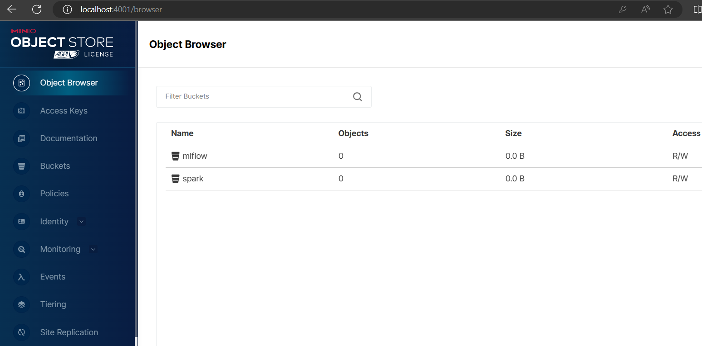
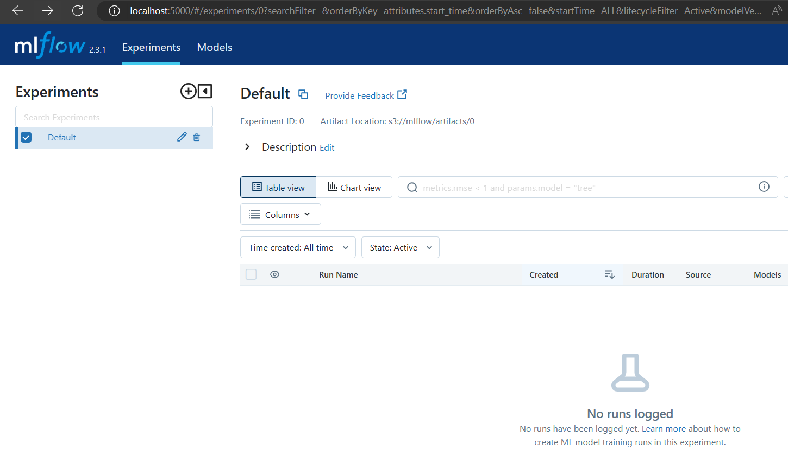
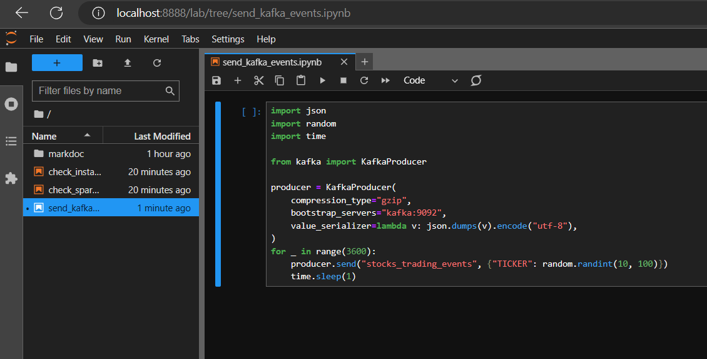
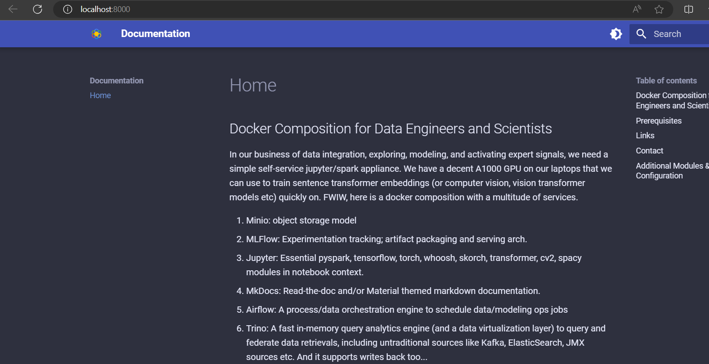
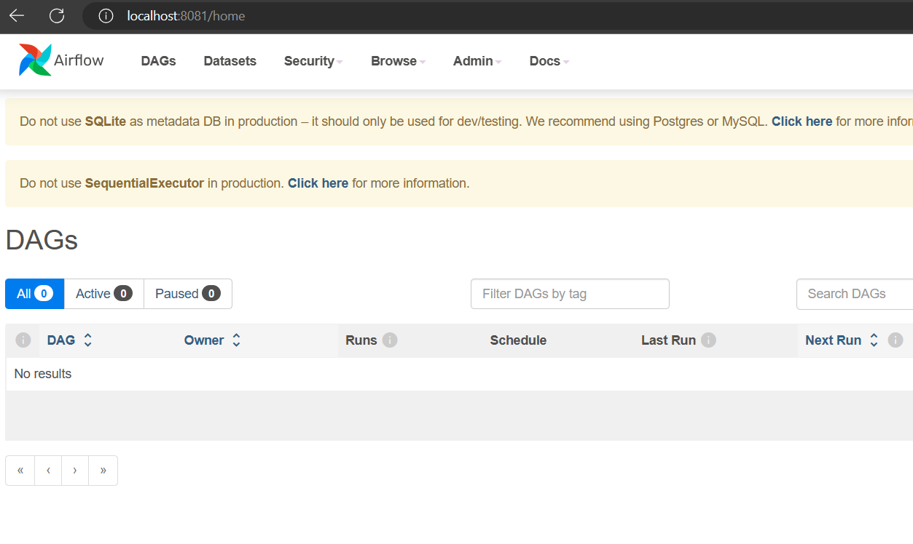
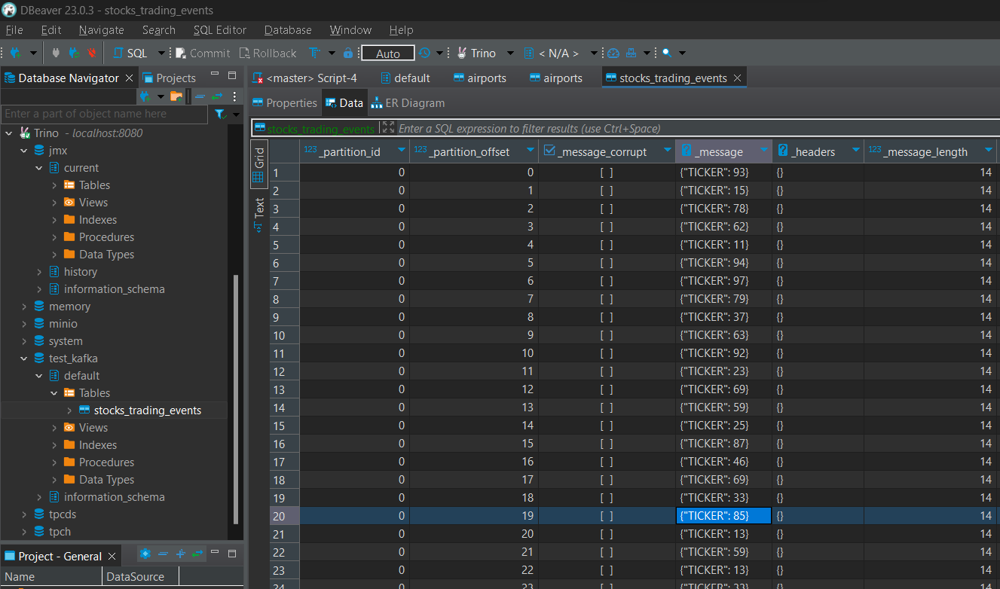
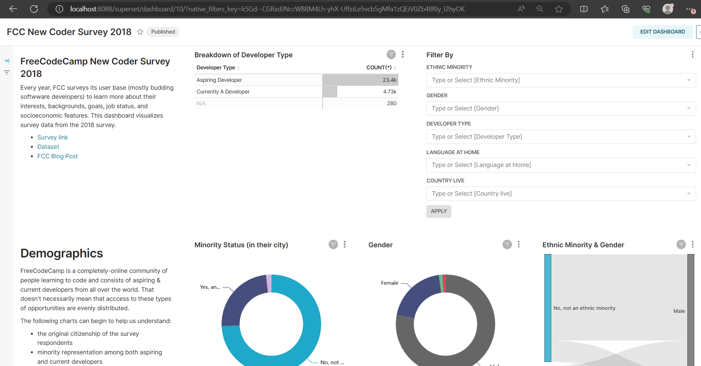

# Docker Composition for Data Engineers and Scientists

In our business of data integration, exploring, modeling, and activating expert signals, we need a simple self-service jupyter/spark appliance. We have a decent A1000 GPU on our laptops that we can use to train sentence transformer embeddings (or computer vision, vision transformer models etc) quickly on. FWIW, here is a docker composition with a multitude of services.

 1. Minio: object storage model
 2. MLFlow: Experimentation tracking; artifact packaging and serving arch.
 3. Jupyter: Essential pyspark, tensorflow, torch, whoosh, skorch, transformer, cv2, spacy modules in notebook context.
 4. MkDocs: Read-the-doc and/or Material themed markdown documentation.
 5. Airflow: A process/data orchestration engine to schedule data/modeling ops jobs
 6. Trino: A fast in-memory query analytics engine (and a data virtualization layer) to query and federate data retrievals, including untraditional sources like Kafka, ElasticSearch, JMX sources etc. And it supports writes back too...
 7. Superset: A cloud based self-service WYSIWYG tool that allows you to build quick/compelling visual dashboards and reports to socialize among teams/leadership
 8. Kafka: a bigdata pubsub middleware that allows loose-coupling, long resiliency, in-order, at-most/at-least-once guarantees etc for fast streaming datasets

## Prerequisites
Install Docker on WSL2 or any other docker host (with compose). Download the repository. Extract the zip package and switch into the terminal directory where the `docker-compose.yml` resides.

Depending on whether you have a NVidia and/or Intel/AMD cards for AI acceleration, I suggest you use one of the two different commands below. If you have the GPU and need (data scientists) the acceleration:

```bash
docker-compose -f docker-compose-gpu.yml up --build
```

Otherwise, for CPU only systems (like data engineers)

```bash
docker-compose -f docker-compose-cpu-only.yml up --build
```

should spin up all the necessary services.

## Links
1. [Minio -- http://localhost:9000](http://localhost:9000) -- `accesskey/secretkey`


2. [MLFlow -- http://localhost:5000](http://localhost:5000)


3. [Jupyter -- http://localhost:8888](http://localhost:8888). I have put a few notebooks that show creation of Parquet, S3 objects, Delta and Delta Live Tables here.


4. [MkDoc -- http://localhost:8000](http://localhost:8000)


5. [Airflow -- http://localhost:8081](http://localhost:8081)


6. [Trino -- http://localhost:8080](http://localhost:8080)


7. [Superset -- http://localhost:8088](http://localhost:8088)


## Contact
Contact [`Seshu Edala`](mailto:nedala@gmail.com) if you have any questions.

## Additional Modules & Configuration
 - `accesskey/secretkey` -- Minio access credentials
 - `admin/admin` -- Airflow's access credentials
 - `addl_requirements.txt` -- add any additional `pip` modules here
 - `admin`/`admin` -- Superset Access Credentials
 - `sa`/`b8:,x5u36$7xD(86` -- MSSQL Access Credentials
 - `kafka:9092` is the Kafka Broker from inside Jupyter. `localhost:9094` from the docker host.
